# College OS Student UI Audit

> **Master UI & Information Architecture Audit**  
> **Audited File**: Entire Student Frontend Repository (`frontend/app/student`, `frontend/components`)  
> **Instruction Compliance**: Strict adherence to `docs/AI_INSTRUCTIONS.md`, Next.js App Router conventions, and the Page/Assembler component pattern.  
> **Status**: Comprehensive Analysis Completed — **Zero code/UI modifications executed during audit.**

---

## 1. Executive Summary

A comprehensive, code-level inspection of the entire College OS student-facing frontend was performed. The audit analyzed all 12 top-level modules, their assembler components, child sections, interactive elements, navigation anchors, modal managers, and data pipelines.

| Category | Metric Count | Key Insights |
| :--- | :---: | :--- |
| **Existing Top-Level Student Routes** | **12** | All 12 primary hub pages exist and render via Next.js App Router thin pages. |
| **Missing Full Pages / Routes** | **12** | Crucial entity detail views (Project, Assignment, Event, Notice, Opportunity, Public Student Profile, Course Details, Search Results, Notifications Center). |
| **Missing Sub-Pages** | **7** | Deep workflow workspaces (Edit Profile, Applications Tracker, Resume Builder, My Reports Center, Grade Card Portal, Saved Items Hub, Security Center). |
| **Missing Modals / Drawers** | **9** | Contextual overlays required for speed and focus (Command Palette `⌘K`, Notification Popover, User Dropdown Menu, Quick Contact, Document Viewer). |
| **Dead / Incomplete Interactions** | **23** | Discovered unhandled `onClick` handlers, empty buttons, non-clickable cards/avatars, and 12 broken relative links in Dashboard pointing to `/academics` instead of `/student/academics`. |
| **Reusable Target Destinations** | **6** | Shared destination pages that will satisfy over 40 distinct entry points across the app. |
| **Total Remaining Student UI Surface Area** | **28 flows/destinations** | 12 Full Pages + 7 Sub-Pages + 9 Supporting Modals/Drawers. |

---

## 2. Existing Student Pages

The following 12 top-level student pages currently exist under `frontend/app/student/`. Each page utilizes the standard **Page → Assembler Component → Child Components** architecture.

| Page Name | Current Route | Assembler Component | Status | Main Purpose & Current Implementation |
| :--- | :--- | :--- | :---: | :--- |
| **Home (Dashboard)** | `/student` | `components/dashboard/Dashboard.jsx` | Complete UI | Central daily command center: Welcome hero, summary metrics, today's timetable, upcoming assignments, attendance overview, academic performance, projects, notices, events, opportunities, profile widget, and Campus AI quick ask. |
| **Campus AI** | `/student/campus-ai` | `components/campus-ai/CampusAI.jsx` | Complete UI | ChatGPT-style viewport-aware workspace (`100dvh`): attached sticky composer, independently scrollable thread, quick prompts, response actions (copy/regenerate), source tags (MongoDB, RAG, General AI), and knowledge panel. |
| **Academics** | `/student/academics` | `components/academics/Academics.jsx` | Complete UI | Academic overview, CGPA circular gauge, performance trend line chart, current semester subjects (6), semester grades table, results download card, upcoming exams, calendar, revaluation modal, and study plan modal. |
| **Assignments** | `/student/assignments` | `components/assignments/Assignments.jsx` | Complete UI | 2/3 + 1/3 desktop layout: reactive status tabs (All, Pending, Submitted, Overdue), live search, subject dropdown, paginated cards (6/page), submission modal, upload assignment modal, deadlines, and submission stats. |
| **Notices & Announcements** | `/student/notices` | `components/notices/Notices.jsx` | Complete UI | 2/3 + 1/3 desktop layout: Notices vs Announcements tabs, Department and Category dropdowns, live search, 18 realistic items, pinned badges, 6-card pagination, details modal, notification preferences modal, and contact admin modal. |
| **Events** | `/student/events` | `components/events/Events.jsx` | Complete UI | Events showcase: Status tabs (Upcoming, Ongoing, Past), category filters, monthly calendar date picker, event registration modal, submit event proposal modal, reminder modal, and pagination. |
| **Projects** | `/student/projects` | `components/projects/Projects.jsx` | Complete UI | Student project showroom: Category chips, branch dropdown, sorting, project cards with tech badges and team avatars, project details modal with live demo links, comments, create project modal, and leaderboard. |
| **Internships & Hackathons** | `/student/internships` | `components/internships/InternshipsHackathons.jsx` | Complete UI | Career opportunities hub: Type toggle (All, Internships, Hackathons, Open to All), filter drawer, opportunity details modal, apply modal with resume upload, submit opportunity modal, and quick action modals suite. |
| **Lost & Found** | `/student/lost-and-found` | `components/lost-and-found/LostAndFound.jsx` | Complete UI | Campus recovery network: Lost vs Found tabs, category chips, sticky desktop right rail (`top-[84px]`), item cards with location metadata, report lost modal, report found modal, and contact owner modal. |
| **Campus Feed** | `/student/feed` | `components/campus-feed/CampusFeed.jsx` | Complete UI | Social campus community: Feed tabs (For You, Following, Latest), rich media post composer, interactive cards with like/comment/share/bookmark, join community modal, event register modal, and trending topics. |
| **My Profile** | `/student/profile` | `components/profile/Profile.jsx` | Complete UI | 2-column student portfolio: Profile hero with verified badge, completion gauge, interactive section scroll spy tabs (Overview, About, Skills, Projects, Achievements, Activity), stats, and social links. |
| **Settings** | `/student/settings` | `components/settings/Settings.jsx` | Complete UI | Account info with avatar upload, appearance preferences (theme, accent colors), notifications toggles, security (password modal, login activity modal), FAQ modal, and feedback modal. |

---

## 3. Missing Full Pages

These are dedicated, URL-addressable routes required because they represent deep entities, shareable permalinks, or complex multi-step workspaces that cannot be confined to small modals.

| ID | Page Name | Triggered From | Recommended Route | Why Full Page is Needed | Key Dependencies |
| :---: | :--- | :--- | :--- | :--- | :--- |
| **FP-01** | **Project Details** | Projects gallery, Profile featured projects, Campus Feed shares, Search, Notifications | `/student/projects/[id]` | Full architecture overview, live demo iframe/preview, embedded GitHub stats, team member directory with roles, task roadmap, rich comments thread, and related projects. | Project data, Team members, Comments schema, Like/Star state |
| **FP-02** | **Assignment Submission Workspace** | Assignments list ("View Details"), Dashboard upcoming assignments, Academics links | `/student/assignments/[id]` | Dedicated focus workspace: rich problem description, teacher rubrics, downloadable resources, code/doc upload editor, past submission versions, and grading remarks. | Assignment data, File upload handler, Submission status |
| **FP-03** | **Event Details & Ticket Pass** | Events grid ("View Details"), Dashboard events, Feed event posts, Notifications | `/student/events/[id]` | Full schedule timeline, speaker bios, venue directions/map, digital QR entry ticket pass, attendee directory, and event Q&A board. | Event data, Registration state, QR generator, Attendee list |
| **FP-04** | **Notice Reader & Circular** | Notices list ("View Notice"), Dashboard notices, Academics notices, Notifications | `/student/notices/[id]` | Formal university circular layout: official letterhead, embedded document/PDF previewer, printable notice sheet, department signatory credentials, and related circulars. | Notice data, Document viewer, Department metadata |
| **FP-05** | **Opportunity Details** | Internships gallery, Dashboard recommendations, Career banners, Notifications | `/student/internships/[id]` | Comprehensive job/hackathon briefing: company dossier, detailed eligibility checklist, stipend/perks breakdown, hiring stages timeline, and direct application form. | Opportunity data, Company profile, Application pipeline |
| **FP-06** | **Public Student Profile** | Project team avatars, Feed author tags, People You May Know, Lost & Found finder | `/student/profile/[id]` | Enables students to view peer profiles: public projects, achievements, shared skills, enrolled courses, and peer connect/message actions. | User profile data, Public projects, Connection status |
| **FP-07** | **Global Search Discovery** | Navbar Search input (Enter / `⌘K`), Mobile search toggle | `/student/search` | Multi-domain discovery engine: faceted tabs (All, Students, Projects, Assignments, Events, Notices, Internships), filters, and query highlighting. | Search index, Filter tokens, Domain result formatters |
| **FP-08** | **Notification Center** | Navbar Notification Bell ("View All"), System alerts | `/student/notifications` | Full chronological audit log of college activities: academic alerts, grades, assignment deadlines, event reminders, project reactions, and bulk mark-as-read. | Notification schema, Read/unread state, Category filters |
| **FP-09** | **Subject / Course Details** | Academics current subjects ("View All Subjects" / card click), Timetable slots | `/student/academics/subjects/[code]` | Deep curriculum hub: course syllabus, lecture notes & PPTs by unit, faculty office hours, attendance log for this course, and internal assessment breakdown. | Subject syllabus data, Faculty info, Attendance logs |
| **FP-10** | **Academic Timetable & Master Calendar** | Dashboard timetable ("View Full Timetable"), Academics quick actions | `/student/academics/timetable` | Interactive weekly timetable grid with lecture/lab room numbers, professor details, exam schedule overlay, holiday calendar, and iCal export. | Timetable dataset, Room allocation, Academic calendar |
| **FP-11** | **Campus Feed Post Discussion** | Campus Feed post card, Comments button, Notifications, Shared post URL | `/student/feed/[id]` | Permalink discussion view: post content with full media gallery, threaded nested comments, poll analytics, and sharing controls. | Post data, Threaded comments, Poll votes, User engagement |
| **FP-12** | **Campus Community / Club Hub** | Campus Feed "Join Community", Trending tags, Club events | `/student/feed/groups/[id]` | Dedicated club headquarters (GDSC, Robotics, Cultural): club announcements, executive committee, member list, club events, and discussion channel. | Group metadata, Club members, Event links, Post feeds |

---

## 4. Missing Sub-Pages

Sub-pages that represent deeper workflows under an established parent module.

| ID | Sub-Page Name | Parent Module | Primary Trigger | Presentation Type | Functional Purpose |
| :---: | :--- | :--- | :--- | :---: | :--- |
| **SP-01** | **Edit Profile & Portfolio** | My Profile | "Edit Profile" button in `ProfileHero.jsx` | Sub-Page (`/student/profile/edit`) | Multi-section portfolio manager: Personal bio, avatar & campus banner upload, social links (GitHub, LinkedIn, Portfolio), skills manager, and resume upload. |
| **SP-02** | **Applications Tracker** | Internships | "My Applications" in `QuickActionsCard.jsx` | Sub-Page (`/student/internships/applications`) | Kanban & tabular tracking dashboard showing application stages (Submitted, Review, Interview, Selected, Rejected) across all applied internships & hackathons. |
| **SP-03** | **AI Resume Builder** | Internships | "Resume Builder" in Quick Actions | Sub-Page (`/student/internships/resume-builder`) | Interactive student resume creator: auto-populates coursework, CGPA, projects, and skills from College OS profile with live ATS preview and PDF download. |
| **SP-04** | **My Reports & Claim Center** | Lost & Found | "My Reports" in `QuickActionsCard.jsx` | Sub-Page (`/student/lost-and-found/my-reports`) | Management dashboard for student's reported items: edit listing description, upload proof photos, review received inquiries, and mark item as Resolved. |
| **SP-05** | **Grade Card & Transcript Portal** | Academics | "Results & Grade Card" download cards | Sub-Page (`/student/academics/grade-card`) | Official semester-wise marks card and cumulative grade point history with provisional transcript generator and university verification seal. |
| **SP-06** | **Saved Items & Bookmarks Hub** | My Profile / Feed | "Saved Posts" in Feed / "Bookmarks" in Projects | Sub-Page (`/student/saved`) | Centralized repository consolidating all bookmarked projects, saved feed posts, pinned notices, and saved career opportunities into one clean tabbed view. |
| **SP-07** | **Security & Connected Accounts** | Settings | "Security & Privacy" in `Settings.jsx` | Sub-Page (`/student/settings/security`) | Detailed account protection settings: 2-Factor Authentication setup, active login sessions with IP/device list, password rotation, and OAuth connections. |

---

## 5. Missing Modals / Drawers

Contextual dialogs and side drawers required for fast, lightweight actions that should not navigate away from the current page.

| ID | Flow / Feature | Trigger Element | Component Type | Required Fields / Content |
| :---: | :--- | :--- | :---: | :--- |
| **MD-01** | **Global Command Palette (`⌘K`)** | Navbar search bar focus or `⌘K` keyboard shortcut | Centered Modal Overlay | Fuzzy search input, keyboard navigation (`↑`/`↓`/`Enter`), quick route shortcuts (Go to Academics, Open Campus AI, Report Lost Item), and recent searches. |
| **MD-02** | **Notification Quick Panel** | Navbar Bell Icon (`Navbar.jsx`) | Top-Right Popover Drawer | Tabs (All, Unread, Mentions), top 5 recent notifications with timestamp and category icons, "Mark all as read", and "View All Notifications" link. |
| **MD-03** | **Navbar User Profile Dropdown** | Navbar User Card (`Navbar.jsx`) | Top-Right Popover Menu | Student summary (Avatar, Name, USN/Roll), Links: My Profile, Account Settings, Saved Items, Switch Theme, Help & FAQs, and Sign Out. |
| **MD-04** | **Edit Project / Team Modal** | Project author actions in Project Card / Details | Centered Modal | Project title, summary, tech stack selector, GitHub repo link, Live demo link, and add/remove team collaborators by roll number. |
| **MD-05** | **Submission History & Feedback Modal** | Assignment Card "Submission History" | Centered Modal | Version list (v1, v2), upload date, attached file preview, teacher grading rubric score, and faculty written remarks. |
| **MD-06** | **Peer Direct Message / Connect Modal** | Student Card "Connect" / Project member click | Centered Modal | Recipient student preview, message subject, collaboration proposal text, and "Send Invitation" button. |
| **MD-07** | **Claim Item Verification Modal** | Lost & Found Card "Claim Item" | Centered Modal | Proof of ownership description, serial number/unique mark input, purchase receipt / photo upload, and contact phone toggle. |
| **MD-08** | **Document / Attachment Viewer Modal** | Notice attachments / Assignment files / Syllabus | Fullscreen Modal | In-browser preview for PDF, DOCX, and high-res image files with zoom controls, page navigation, and download button. |
| **MD-09** | **Mobile Filter Drawer** | Filter button on Mobile viewports (`< lg`) | Bottom Sheet / Drawer | Unified responsive slide-over drawer housing all active page filters, categories, and reset buttons without breaking desktop layout. |

---

## 6. Dead / Incomplete Interactions

The following UI elements currently appear interactive in the code (styled with cursor-pointer, hover transitions, or button tags) but have missing `onClick` handlers, empty callbacks, or point to non-existent routes.

| UI Element | Current File & Line | Current Behavior | Expected Destination / Action | Status & Fix Needed |
| :--- | :--- | :--- | :--- | :--- |
| **Navbar Search Bar** | `Navbar.jsx` (L98-102) | Static input; typing produces no results | Opens Command Palette (`MD-01`) or navigates to `/student/search` (`FP-07`) | **Dead Input** — Needs `onChange`/`onKeyDown` handler |
| **Navbar ⌘K Shortcut** | `Navbar.jsx` (L105-107) | Static `<kbd>` badge | Global window listener triggers Command Palette | **Missing Listener** — Needs `useEffect` keydown listener |
| **Navbar Notification Bell** | `Navbar.jsx` (L117-126) | `<button>` with badge "3"; click does nothing | Opens Notification Popover (`MD-02`) | **Dead Button** — Needs toggle state and drawer component |
| **Navbar User Profile Card** | `Navbar.jsx` (L150-173) | Hover styling with ChevronDown; click does nothing | Opens User Menu Popover (`MD-03`) | **Dead Menu** — Needs popover dropdown component |
| **Dashboard "View Full Timetable"** | `TodayTimetable.jsx` (L67) | `<Link href="/academics">` | Navigates to `/student/academics` or Timetable (`FP-10`) | **Broken Link (404)** — Missing `/student` route prefix |
| **Dashboard "View All Assignments"** | `UpcomingAssignments.jsx` (L51) | `<Link href="/assignments">` | Navigates to `/student/assignments` | **Broken Link (404)** — Missing `/student` route prefix |
| **Dashboard "View All Events"** | `UpcomingEvents.jsx` (L46) | `<Link href="/events">` | Navigates to `/student/events` | **Broken Link (404)** — Missing `/student` route prefix |
| **Dashboard "View All Notices"** | `RecentNotices.jsx` (L49) | `<Link href="/notices">` | Navigates to `/student/notices` | **Broken Link (404)** — Missing `/student` route prefix |
| **Dashboard "View All Projects"** | `StudentProjects.jsx` (L65) | `<Link href="/projects">` | Navigates to `/student/projects` | **Broken Link (404)** — Missing `/student` route prefix |
| **Dashboard "View Opportunities"** | `RecommendedOpportunities.jsx` (L46) | `<Link href="/internships">` | Navigates to `/student/internships` | **Broken Link (404)** — Missing `/student` route prefix |
| **Dashboard Quick Actions (6 links)** | `QuickActions.jsx` (L14-19) | `href` points to `/academics`, `/assignments`, etc. | All 6 links must point to `/student/*` routes | **Broken Links (404)** — Missing `/student` route prefix |
| **Dashboard Profile Card Link** | `StudentProfileCard.jsx` (L59) | `<Link href="/profile">` | Navigates to `/student/profile` | **Broken Link (404)** — Missing `/student` route prefix |
| **Profile "Edit Profile" Button** | `ProfileHero.jsx` (L105-111) | `<button type="button">` with NO `onClick` | Navigates to `/student/profile/edit` (`SP-01`) or modal | **Dead Button** — Empty click handler |
| **Profile Camera Icon (Change Photo)**| `ProfileHero.jsx` (L49-56) | `<button type="button">` with NO `onClick` | Triggers image file picker or avatar modal | **Dead Button** — Empty click handler |
| **Profile Edit Quote Button** | `ProfileHero.jsx` (L90-97) | `<button type="button">` with NO `onClick` | Inlines editable input or quote modal | **Dead Button** — Empty click handler |
| **Profile Stat Pills (Followers/Following)**| `ProfileHero.jsx` (L115-141) | Static pill cards; hoverable but not clickable | Opens Followers / Following student list modal | **Incomplete Interaction** — Static numbers |
| **Profile Project Cards** | `ProfileProjectsCard.jsx` (L64-139) | Title & card body not clickable (only external links) | Opens Project Details Page (`FP-01`) | **Incomplete Interaction** — Card click missing |
| **Academics "View All Subjects"** | `CurrentSemesterSubjectsCard.jsx` (L57-63) | `<button type="button">` with NO `onClick` | Navigates to Course Catalog or filters subjects | **Dead Button** — Empty click handler |
| **Academics Subject Cards** | `CurrentSemesterSubjectsCard.jsx` (L69-110) | Cards hoverable but non-clickable | Opens Subject / Course Details (`FP-09`) | **Incomplete Interaction** — Cards not linked |
| **Academics "View All Marks"** | `SemesterGradesCard.jsx` (L38-45) | `<button type="button">` with NO `onClick` | Opens Grade Card Portal (`SP-05`) | **Dead Button** — Empty click handler |
| **Project Contributor Avatars** | `ProjectCard.jsx` (L147-167) | Avatars render in circular badges without links | Navigates to Public Student Profile (`FP-06`) | **Incomplete Interaction** — Avatars not linked |
| **Lost & Found "Mark Resolved"** | `LostFoundDetailsModal.jsx` (L23) | `onMarkResolved` prop defined in component arguments | Should render "Mark as Resolved" button for item owner | **Unrendered Prop** — Action missing from footer UI |
| **Campus Feed Author Avatars/Names** | `FeedPostCard.jsx` | User avatars render without links | Navigates to Public Student Profile (`FP-06`) | **Incomplete Interaction** — Avatars not linked |

---

## 7. Existing Pages Reused by Multiple Features

To preserve architectural integrity and prevent duplicate code, single canonical destinations should be created to serve multiple application entry points:

```mermaid
graph TD
    subgraph Shared Destinations
        P1[FP-01: Project Details]
        P2[FP-06: Student Profile]
        P3[FP-02: Assignment Details]
        P4[FP-03: Event Details]
        P5[FP-04: Notice Reader]
        P6[FP-05: Opportunity Details]
    end

    ProjectsHub[Projects Gallery] --> P1
    ProfileFeatured[Profile Featured Projects] --> P1
    FeedPostProject[Campus Feed Projects] --> P1
    SearchProjects[Global Search] --> P1
    NotifProject[Project Notifications] --> P1

    TeamAvatars[Project Team Avatars] --> P2
    FeedAuthors[Feed Post Authors] --> P2
    PeopleYouKnow[People You May Know] --> P2
    LostFoundReporter[Lost & Found Reporters] --> P2
    SearchStudents[Search Student Directory] --> P2

    AssignmentsHub[Assignments Hub] --> P3
    DashDeadlines[Dashboard Deadlines] --> P3
    AcademicsTimetable[Academics Coursework] --> P3
    NotifAssignment[Assignment Notifications] --> P3

    EventsHub[Events Portal] --> P4
    DashEvents[Dashboard Events] --> P4
    FeedEvents[Campus Feed Events] --> P4
    NotifEvents[Event Reminders] --> P4

    NoticesHub[Notices Hub] --> P5
    DashNotices[Dashboard Notices] --> P5
    AcademicsNotices[Academics Notices Card] --> P5
    NotifNotices[Urgent Circular Alerts] --> P5

    InternshipsHub[Internships Hub] --> P6
    DashOpportunities[Dashboard Recommendations] --> P6
    PromoBanners[Career CTA Banners] --> P6
```



---

## 8. Student Navigation Map

The complete, unified Information Architecture of the College OS Student Portal:

```text
Student Portal (/student)
├── Home (Dashboard)
│   ├── Quick Actions (Timetable, Attendance, Assignments, Marks, Projects, Internships)
│   ├── Today's Timetable → [FP-10: Master Timetable & Calendar]
│   ├── Upcoming Assignments → [FP-02: Assignment Submission Workspace]
│   ├── Attendance & Performance → [Academics Portal]
│   ├── Recent Notices → [FP-04: Notice Reader & Circular]
│   ├── Upcoming Events → [FP-03: Event Details & Ticket Pass]
│   ├── Recommended Opportunities → [FP-05: Opportunity Details]
│   └── Campus AI Quick Ask → [Campus AI Workspace]
│
├── Campus AI (/student/campus-ai)
│   ├── Chat Workspace (100dvh attached composer, thread history)
│   ├── Knowledge Panel (Documents, Guidelines, Policies) → [MD-08: Document Viewer]
│   ├── Recent Queries Popover
│   └── Prompt Library & Source Badges (MongoDB, RAG, General AI)
│
├── Academics (/student/academics)
│   ├── Academic Overview & CGPA Gauge
│   ├── Performance Trend Chart
│   ├── Current Semester Subjects → [FP-09: Subject / Course Details]
│   ├── Semester Grades Table → [SP-05: Grade Card & Transcript Portal]
│   ├── Results & Grade Card Download → [SP-05: Grade Card Portal]
│   ├── Upcoming Exam Schedule
│   ├── Semester Calendar Grid → [FP-10: Master Timetable & Calendar]
│   ├── Revaluation Application Modal
│   └── Study Reminder Modal
│
├── Assignments (/student/assignments)
│   ├── Filter Toolbar (All, Pending, Submitted, Overdue, Subject, Search)
│   ├── Assignment Cards List → [FP-02: Assignment Submission Workspace]
│   │   ├── View Details & Rubrics
│   │   ├── Submit Work Modal
│   │   └── Submission History Modal [MD-05]
│   ├── Upload Assignment Modal
│   └── Deadlines & August 2025 Calendar
│
├── Notices & Announcements (/student/notices)
│   ├── Notices vs Announcements Tabs
│   ├── Department & Category Filter Matrix
│   ├── Notice Cards List → [FP-04: Notice Reader & Circular]
│   │   ├── Embedded Document Preview [MD-08]
│   │   ├── Share Notice Action
│   │   └── Mark as Read Action
│   ├── Notification Settings Modal
│   └── Contact Department Admin Modal
│
├── Events (/student/events)
│   ├── Status Filter Tabs (Upcoming, Ongoing, Past)
│   ├── Event Category Selector
│   ├── Monthly Calendar Day Picker
│   ├── Event Grid Cards → [FP-03: Event Details & Ticket Pass]
│   │   ├── Register for Event Modal
│   │   ├── Digital QR Pass Preview
│   │   └── Interested / Bookmark Action
│   ├── Submit Event Proposal Modal
│   └── Event Notification Preferences Modal
│
├── Projects (/student/projects)
│   ├── Project Tabs (All, My Projects, Liked, My Team)
│   ├── Category & Branch Filter Matrix
│   ├── Project Grid Cards → [FP-01: Project Details Page]
│   │   ├── Live Demo External Link
│   │   ├── GitHub Repo External Link
│   │   ├── Contributor Avatars → [FP-06: Public Student Profile]
│   │   └── Like / Bookmark Actions
│   ├── Create Project Modal
│   ├── Post Project Idea CTA
│   └── Project Collaboration Card
│
├── Internships & Hackathons (/student/internships)
│   ├── Opportunity Type Toggle (All, Internships, Hackathons, Open to All)
│   ├── Advanced Filter Drawer (Work mode, Location, Duration, Skills)
│   ├── Opportunity Cards → [FP-05: Opportunity Details Page]
│   │   ├── Apply / Register Modal
│   │   └── Save Opportunity Action
│   ├── Applications Tracker → [SP-02: Applications Tracker]
│   ├── AI Resume Builder → [SP-03: Resume Builder Tool]
│   └── Submit Opportunity Modal
│
├── Lost & Found (/student/lost-and-found)
│   ├── Status Filter Tabs (All, Lost, Found)
│   ├── Sticky Desktop Right Rail
│   ├── Item Cards List → Details Modal
│   │   ├── Contact Owner / Claim Modal
│   │   ├── Claim Ownership Verification [MD-07]
│   │   └── Mark as Resolved Action
│   ├── Report Lost Item Modal
│   ├── Report Found Item Modal
│   └── My Reports Management → [SP-04: My Reports & Claim Center]
│
├── Campus Feed (/student/feed)
│   ├── Feed Tabs (For You, Following, Latest)
│   ├── Create Post Rich Media Composer
│   ├── Feed Post Cards → [FP-11: Post Discussion Page]
│   │   ├── Author Profile → [FP-06: Public Student Profile]
│   │   ├── Threaded Comments & Replies
│   │   ├── Like / Share / Bookmark Actions
│   │   └── Report Post Modal
│   ├── Community Cards → [FP-12: Campus Community / Club Hub]
│   └── People You May Know → [FP-06: Public Student Profile]
│
├── My Profile (/student/profile)
│   ├── Profile Hero (Verified Badge, Degree, Campus Banner, Avatar)
│   │   ├── Edit Profile Action → [SP-01: Edit Profile & Portfolio]
│   │   └── Followers / Following Count → Followers Modal
│   ├── Scroll-Spy Section Tabs (Overview, About, Skills, Projects, Achievements, Activity)
│   ├── Featured Projects → [FP-01: Project Details Page]
│   ├── Skills & Endorsements
│   ├── Badges & Achievements
│   ├── Saved Items Link → [SP-06: Saved Items & Bookmarks Hub]
│   └── Social Links & Contact Info
│
├── Settings (/student/settings)
│   ├── Account Profile Summary → Edit Profile Modal
│   ├── Appearance (Dark/Light Theme, Live 12-Font Switcher, Accent Colors)
│   ├── Notification Preferences (Assignments, Events, Notices, Social)
│   ├── Security & Privacy → [SP-07: Security & Connected Accounts]
│   ├── FAQs & Support Ticket Modal
│   └── Feedback Modal
│
├── Global Navigation Utilities (Shell)
│   ├── Command Palette Modal [MD-01] (`⌘K`)
│   ├── Global Search Results Page [FP-07] (`/student/search`)
│   ├── Notification Center [FP-08] & Popover [MD-02] (`/student/notifications`)
│   └── User Profile Menu [MD-03]
```

---

## 9. Page Dependency Map

Visualizes the dependencies, required data contracts, and associated components for each missing core page.

### 1. `FP-01: Project Details` (`/student/projects/[id]`)
- **Entry Points**: Projects showroom, Profile projects card, Campus Feed project cards, Global Search, Notifications.
- **Required Data**: Project ID, title, description, category, tech stack, architecture diagram URL, GitHub repo stats (stars, forks, open issues), Live demo URL, author ID, collaborator array (IDs, names, avatars, roles), likes count, and nested comments array.
- **Related Existing Pages**: `/student/projects`, `/student/profile`.
- **Reusable By**: Project showcase, peer portfolios, collaborative team builder.

### 2. `FP-02: Assignment Submission Workspace` (`/student/assignments/[id]`)
- **Entry Points**: Assignments card list, Dashboard upcoming deadlines, Academics timetable/assignments link, Push notifications.
- **Required Data**: Assignment ID, subject code, title, detailed brief, teacher instructions, rubric breakdown, allowed file types, max file size, deadline timestamp, submission status, submitted file URL, version history, grade/marks awarded, and faculty remarks.
- **Related Existing Pages**: `/student/assignments`, `/student/academics`.

### 3. `FP-03: Event Details & Ticket Pass` (`/student/events/[id]`)
- **Entry Points**: Events grid, Dashboard upcoming events, Campus Feed event posts, Shared event link, Reminders.
- **Required Data**: Event ID, title, banner image, date/time, venue/room, category, organizer details, registration status, seat quota, attendee list, speaker profiles, agenda schedule, and unique digital QR ticket pass code.
- **Related Existing Pages**: `/student/events`, `/student/feed`.

### 4. `FP-04: Notice Reader & Circular` (`/student/notices/[id]`)
- **Entry Points**: Notices list, Dashboard recent notices, Academics notices card, Notifications.
- **Required Data**: Notice ID, reference number, department, published date, category, priority (urgent/normal), official heading, full formatted body text, signatory designation, digital verification seal, and attached downloadable PDF/files.
- **Related Existing Pages**: `/student/notices`, `/student/academics`.

### 5. `FP-05: Opportunity Details` (`/student/internships/[id]`)
- **Entry Points**: Opportunities gallery, Dashboard recommended opportunities, Career banners, Notifications.
- **Required Data**: Opportunity ID, type (internship/hackathon), company name, company logo, work mode (remote/onsite/hybrid), location, stipend/prize pool, duration, eligibility criteria, required skills list, application deadline, and company briefing.
- **Related Existing Pages**: `/student/internships`, `/student/profile`.

### 6. `FP-06: Public Student Profile` (`/student/profile/[id]`)
- **Entry Points**: Project contributor avatars, Campus feed authors and commenters, People you may know, Lost & found reporters, Search results.
- **Required Data**: Student ID, full name, avatar, campus banner, branch, semester, CGPA (privacy gated), bio, verified status, social URLs, public projects array, badges array, skills array, and connect/connection status.
- **Related Existing Pages**: `/student/profile`, `/student/projects`, `/student/feed`.

---

## 10. Recommended Build Order

To maximize velocity and avoid broken dependencies, future implementation should proceed in five logical phases ordered by dependency hierarchy and incoming link volume.

```text
PHASE A: Core Detail Pages (Highest Link Volume)
├── 1. FP-01: Project Details (/student/projects/[id])
├── 2. FP-02: Assignment Submission Workspace (/student/assignments/[id])
├── 3. FP-03: Event Details & Ticket Pass (/student/events/[id])
├── 4. FP-04: Notice Reader & Circular (/student/notices/[id])
└── 5. FP-05: Opportunity Details (/student/internships/[id])

PHASE B: Peer Ecosystem & Action Workspaces
├── 6. FP-06: Public Student Profile (/student/profile/[id])
├── 7. SP-01: Edit Profile & Portfolio (/student/profile/edit)
├── 8. SP-02: Applications Tracker (/student/internships/applications)
└── 9. SP-04: My Reports & Claim Center (/student/lost-and-found/my-reports)

PHASE C: Academic Curricular Pages
├── 10. FP-09: Subject / Course Details (/student/academics/subjects/[code])
├── 11. FP-10: Academic Timetable & Master Calendar (/student/academics/timetable)
└── 12. SP-05: Grade Card & Transcript Portal (/student/academics/grade-card)

PHASE D: Global Search, Discovery & Community
├── 13. FP-07: Global Search Discovery (/student/search)
├── 14. FP-08: Notification Center (/student/notifications)
├── 15. FP-11: Campus Feed Post Discussion (/student/feed/[id])
├── 16. FP-12: Campus Community / Club Hub (/student/feed/groups/[id])
├── 17. SP-03: AI Resume Builder (/student/internships/resume-builder)
└── 18. SP-06: Saved Items & Bookmarks Hub (/student/saved)

PHASE E: Supporting Modals & Shell Overlays
├── 19. MD-01: Global Command Palette (⌘K)
├── 20. MD-02: Notification Quick Panel (Bell popover)
├── 21. MD-03: Navbar User Profile Dropdown Menu
├── 22. MD-04: Edit Project / Team Modal
├── 23. MD-05: Assignment Submission Version History Modal
├── 24. MD-06: Peer Direct Message / Connect Modal
├── 25. MD-07: Claim Item Verification Modal
├── 26. MD-08: Document / Attachment Viewer Modal
├── 27. MD-09: Mobile Responsive Filter Drawer
└── 28. SP-07: Security & Connected Accounts (/student/settings/security)
```

---

## 11. Design Prompt Requirements

Brief technical and layout specifications for each missing **FULL PAGE**, prepared to facilitate subsequent prompt creation without speculative guessing.

### Specification 1: Project Details (`FP-01`)
- **Page Name**: Project Details
- **Purpose**: Deep showcase of a student software or hardware project, its architecture, live deployment, source code, team, and peer discussions.
- **Entry Points**: `/student/projects` (Card click), `/student/profile` (Featured projects), `/student/feed` (Shared project), Search results, Notifications.
- **Expected Route**: `/student/projects/[id]`
- **Main Sections**: Hero with banner, category badge, star/like buttons; Live demo preview / media showcase; Overview & README markdown section; Tech stack badges; Team members card with roles and contact buttons; Comments & discussions thread; Related projects rail.
- **Primary Actions**: "Star Project", "Fork / View GitHub", "Open Live Demo", "Post Comment".
- **Secondary Actions**: "Share Project", "Report", "Request to Join Team".
- **Required Data**: Project metadata, README markdown, team member array, comments array, engagement counts.
- **Related Existing Pages**: `Projects.jsx`, `Profile.jsx`.
- **Desktop Layout**: 2/3 Main Column (Hero, Media, README, Comments) + 1/3 Right Column (Team, GitHub Stats, Live Demo CTA, Related Projects).
- **Mobile Behavior**: Single column stacking with sticky bottom action bar (Star, Live Demo, Comment).

### Specification 2: Assignment Submission Workspace (`FP-02`)
- **Page Name**: Assignment Submission Workspace
- **Purpose**: Distraction-free academic assignment briefing, downloadable rubrics, file upload workspace, and submission feedback tracker.
- **Entry Points**: `/student/assignments` ("View Details"), `/student` (Upcoming assignments), `/student/academics` (Course links), Notifications.
- **Expected Route**: `/student/assignments/[id]`
- **Main Sections**: Assignment header (Subject, title, marks, deadline urgency gauge); Problem statement & guidelines; Teacher downloadable attachments; Submission file dropzone (drag-and-drop, code/zip/pdf); Past submission versions log; Faculty grade & rubric remarks.
- **Primary Actions**: "Upload & Submit Assignment", "Download Teacher Materials".
- **Secondary Actions**: "Re-submit Assignment", "Ask Subject Faculty a Question".
- **Required Data**: Assignment specs, deadline timestamp, submission status, grade, attached resources.
- **Related Existing Pages**: `Assignments.jsx`, `Academics.jsx`.
- **Desktop Layout**: 2/3 Main Column (Problem Brief, Guidelines, Dropzone, Past Submissions) + 1/3 Right Column (Deadline countdown, Grading Rubric, Faculty Info, Help).
- **Mobile Behavior**: Sequential single-column flow with persistent top status badge.

### Specification 3: Event Details & Ticket Pass (`FP-03`)
- **Page Name**: Event Details & Ticket Pass
- **Purpose**: Comprehensive briefing of campus workshops, fests, hackathons, and guest lectures with interactive RSVP and digital QR entrance pass.
- **Entry Points**: `/student/events` (Card click), `/student` (Upcoming events), `/student/feed` (Event post), Push notifications.
- **Expected Route**: `/student/events/[id]`
- **Main Sections**: Event cover hero with date badge; Event summary & prerequisites; Timeline / schedule agenda; Speaker & guest bios; Digital Ticket Pass with QR code; Venue map & location details; Attendee directory; Event FAQ & contact organizer.
- **Primary Actions**: "Register for Event" / "Download Ticket QR Pass", "Add to Calendar".
- **Secondary Actions**: "Interested / Bookmark", "Share Event", "Ask Organizer".
- **Required Data**: Event schedule, speakers, venue, attendee list, registration state, QR token.
- **Related Existing Pages**: `Events.jsx`, `CampusFeed.jsx`.
- **Desktop Layout**: 2/3 Main Column (Hero, About, Schedule Timeline, Speakers, FAQs) + 1/3 Right Column (Digital Ticket Card, Venue Map, Organizer Card, Add to Calendar).
- **Mobile Behavior**: Stacks cleanly with sticky bottom "Register / View Ticket" button.

### Specification 4: Notice Reader & Circular (`FP-04`)
- **Page Name**: Notice Reader & Circular
- **Purpose**: Official, printable letterhead presentation of departmental and college-wide circulars with document previewer.
- **Entry Points**: `/student/notices` (Card click), `/student` (Recent notices), Notifications ("Urgent Notice").
- **Expected Route**: `/student/notices/[id]`
- **Main Sections**: Formal College OS Header with Reference Number and Date; Department & Issuing Authority badge; Circular title and executive summary; Official notice body; Verified digital signature stamp; Attached document / PDF previewer; Related notices.
- **Primary Actions**: "Download PDF Circular", "Print Notice".
- **Secondary Actions**: "Share Notice", "Acknowledge as Read", "Contact Issuing Department".
- **Required Data**: Notice body, circular ID, issuing authority, digital sign seal, attachment files.
- **Related Existing Pages**: `Notices.jsx`, `Academics.jsx`.
- **Desktop Layout**: Centered document container (`max-w-4xl`) with right sticky utility rail (Print, Download, Share, Related Circulars).
- **Mobile Behavior**: Full-width letterhead layout with zoomable PDF embed.

### Specification 5: Opportunity Details (`FP-05`)
- **Page Name**: Opportunity Details
- **Purpose**: In-depth internship or hackathon briefing, company background, stipend perks, eligibility checks, and application portal.
- **Entry Points**: `/student/internships` (Card click), `/student` (Recommended opportunities), Career CTA banners.
- **Expected Route**: `/student/internships/[id]`
- **Main Sections**: Company banner and logo header; Role title, stipend, work mode, and deadline pills; Job description and day-to-day responsibilities; Candidate qualifications and skill match score; Hiring process stages; Company overview and culture; Direct application submission form.
- **Primary Actions**: "Apply Now" (with 1-click College OS profile resume), "Save Opportunity".
- **Secondary Actions**: "Share Opportunity", "Visit Company Website", "Ask Career Cell".
- **Required Data**: Opportunity description, company details, stipend/perks, candidate match score, application requirements.
- **Related Existing Pages**: `InternshipsHackathons.jsx`, `Profile.jsx`.
- **Desktop Layout**: 2/3 Main Column (Company Overview, Role Brief, Qualifications, Application Form) + 1/3 Right Column (Role Quick Facts, Skill Match Gauge, Deadline Timer, Similar Roles).
- **Mobile Behavior**: Single column with bottom fixed "Apply Now" action drawer.

### Specification 6: Public Student Profile (`FP-06`)
- **Page Name**: Public Student Profile
- **Purpose**: Peer networking portfolio showcasing another student's public projects, technical skills, badges, and verified college standing.
- **Entry Points**: Project contributor avatars, Campus feed post authors, People You May Know cards, Search results.
- **Expected Route**: `/student/profile/[id]`
- **Main Sections**: Peer profile hero (Avatar, branch, semester, verified badge, quote); Peer bio & career interests; Featured student projects; Skills and endorsements; Earned academic badges; Peer activity stream; Collaboration invitation card.
- **Primary Actions**: "Connect / Message Student", "Invite to Project Team".
- **Secondary Actions**: "Endorse Skill", "Share Profile", "Report Account".
- **Required Data**: Student profile, public projects, verified credentials, connection state.
- **Related Existing Pages**: `Profile.jsx`, `Projects.jsx`, `CampusFeed.jsx`.
- **Desktop Layout**: 2/3 Main Column (Hero, About, Projects, Skills, Badges) + 1/3 Right Column (Peer Stats, Mutual Connections, Collaboration Invite, Social Links).
- **Mobile Behavior**: Mirrors current profile responsive layout with sticky "Connect" action.

### Specification 7: Global Search Discovery (`FP-07`)
- **Page Name**: Global Search Discovery
- **Purpose**: Unified multi-domain search and discovery engine across all campus entities with faceted categorization and advanced filtering.
- **Entry Points**: Navbar Search input, ⌘K Command Palette ("See all results"), Mobile search icon.
- **Expected Route**: `/student/search`
- **Main Sections**: Search bar with active query and clear button; Category filter tabs with result counts (All, Students, Projects, Assignments, Events, Notices, Internships); Faceted sidebar (Department, Year, Tag, Date); Paginated search results grid with highlighted match keywords; Empty state with suggested search terms.
- **Primary Actions**: "Filter by Category", "Sort Results (Relevance / Date)", "Clear Search".
- **Secondary Actions**: "Save Search Query", "Jump directly to result".
- **Required Data**: Search query string, search index result objects tagged by domain type, filter facets.
- **Related Existing Pages**: All student hubs.
- **Desktop Layout**: 1/4 Left Filter Rail (Category tabs, Department dropdowns, Date filters) + 3/4 Right Results Feed.
- **Mobile Behavior**: Horizontal scrolling category chips with filter drawer button.

### Specification 8: Notification Center (`FP-08`)
- **Page Name**: Notification Center
- **Purpose**: Complete historical inbox of all academic, social, career, and system notifications with filtering and bulk actions.
- **Entry Points**: Navbar Notification Bell ("View All"), System broadcast popups.
- **Expected Route**: `/student/notifications`
- **Main Sections**: Notification center header with unread badge count; Filter tabs (All, Academic, Assignments, Events, Social & Projects, System); Notification feed cards with category icons, read/unread status, and contextual action buttons; Bulk actions bar ("Mark All as Read", "Clear Read Notifications"); Notification delivery preferences link.
- **Primary Actions**: "Mark All as Read", "Click Notification to Navigate to Deep Link".
- **Secondary Actions**: "Delete Notification", "Filter by Category", "Configure Notification Preferences".
- **Required Data**: Notification list with domain links, timestamp, category, and read state.
- **Related Existing Pages**: `Navbar.jsx`, `Settings.jsx`.
- **Desktop Layout**: 2/3 Main Column (Notification Feed List) + 1/3 Right Column (Quick Stats, Category Breakdown, Notification Settings CTA).
- **Mobile Behavior**: Full-width swipeable notification rows.

### Specification 9: Subject / Course Details (`FP-09`)
- **Page Name**: Subject / Course Details
- **Purpose**: Curricular hub for an enrolled course featuring unit-wise syllabus, professor office hours, course materials, attendance record, and marks.
- **Entry Points**: `/student/academics` (Current semester subject cards / "View All Subjects"), `/student` (Timetable slots).
- **Expected Route**: `/student/academics/subjects/[code]`
- **Main Sections**: Course hero (Subject code, title, credits, instructor name, lecture room); Attendance progress gauge for this subject; Unit-by-unit syllabus breakdown with progress bars; Downloadable lecture notes, PPTs, and reference materials; Internal assessment and mid-term marks record; Subject-specific assignments list; Faculty contact card.
- **Primary Actions**: "Download Complete Course Bundle", "View Subject Attendance Log".
- **Secondary Actions**: "Ask Subject Instructor", "View Course Assignments".
- **Required Data**: Subject syllabus, faculty profile, student attendance per course, unit notes, course marks.
- **Related Existing Pages**: `Academics.jsx`, `Assignments.jsx`.
- **Desktop Layout**: 2/3 Main Column (Subject Hero, Unit Syllabus, Lecture Notes, Course Assignments) + 1/3 Right Column (Subject Attendance Gauge, Faculty Contact, Office Hours, Internal Marks).
- **Mobile Behavior**: Clean vertical stacking with collapsible syllabus units.

### Specification 10: Academic Timetable & Master Calendar (`FP-10`)
- **Page Name**: Academic Timetable & Master Calendar
- **Purpose**: Master interactive weekly timetable with room numbers, lab allocations, faculty schedule, and academic milestone calendar.
- **Entry Points**: `/student` (Timetable "View Full Timetable"), `/student/academics` (Timetable tab).
- **Expected Route**: `/student/academics/timetable`
- **Main Sections**: Weekly schedule selector (Monday through Saturday); Interactive timetable grid with color-coded lecture/lab slots, room numbers, and instructor names; Current ongoing class highlight; Semester holiday and exam overlay; Downloadable/printable timetable sheet; iCal / Google Calendar sync button.
- **Primary Actions**: "Export to Google Calendar / iCal", "Download Printable PDF".
- **Secondary Actions**: "Filter by Lecture vs Lab", "Switch Semester Timetable View".
- **Required Data**: Weekly timetable matrix, class timings, classroom numbers, faculty mapping.
- **Related Existing Pages**: `TodayTimetable.jsx`, `Academics.jsx`.
- **Desktop Layout**: Full-width master weekly calendar matrix with top filter controls.
- **Mobile Behavior**: Horizontal day-by-day swipe view (Mon, Tue, Wed...) with card-based time blocks.

### Specification 11: Campus Feed Post Discussion (`FP-11`)
- **Page Name**: Campus Feed Post Discussion
- **Purpose**: Dedicated permalink view of a community feed post with full media carousel, vote statistics, and threaded nested comment discussions.
- **Entry Points**: `/student/feed` (Post card / comments button), Notifications ("Commented on your post"), Shared link.
- **Expected Route**: `/student/feed/[id]`
- **Main Sections**: Main post card (Author credentials, timestamp, text, high-res image gallery / video player / poll); Engagement bar (Like, comment, share, bookmark); Nested comment thread with author badges and reply buttons; Inline comment box; Related campus discussions rail.
- **Primary Actions**: "Post Reply", "Like Post / Comment", "Share Discussion Link".
- **Secondary Actions**: "Bookmark Post", "Report Discussion", "Follow Author".
- **Required Data**: Post object, media URLs, poll counts, threaded comments array, author credentials.
- **Related Existing Pages**: `CampusFeed.jsx`, `Profile.jsx`.
- **Desktop Layout**: 2/3 Main Column (Original Post, Rich Media, Threaded Comments Composer & Tree) + 1/3 Right Column (Author Mini-Profile, Trending Topics, Community Guidelines).
- **Mobile Behavior**: Single-column conversation thread with sticky bottom reply input.

### Specification 12: Campus Community / Club Hub (`FP-12`)
- **Page Name**: Campus Community / Club Hub
- **Purpose**: Official digital headquarters for college student societies, technical chapters (GDSC, ACM, Robotics), and cultural clubs.
- **Entry Points**: `/student/feed` (Community cards), `/student/events` (Club organized events), Explore clubs.
- **Expected Route**: `/student/feed/groups/[id]`
- **Main Sections**: Club banner, logo, verified society badge, and member count; Executive committee / student lead cards; Club announcements & news feed; Upcoming club workshops and hackathons; Club discussion forum; Join Club / Member status toggle; Resource archive.
- **Primary Actions**: "Join Club / Become Member", "Create Club Post", "RSVP to Club Event".
- **Secondary Actions**: "Contact Club Leads", "Share Club Link", "View Member Directory".
- **Required Data**: Club metadata, leads roster, members list, club-specific feed posts, club events.
- **Related Existing Pages**: `CampusFeed.jsx`, `Events.jsx`.
- **Desktop Layout**: 2/3 Main Column (Club Banner, About, Community News Feed, Club Discussions) + 1/3 Right Column (Executive Leads, Upcoming Club Events, Join Status, Resource Links).
- **Mobile Behavior**: Hero banner with sticky "Join Club" action bar and tabbed content view (Feed, Events, Members).

---

## 12. Final Count & Surface Summary

The complete inventory of existing vs remaining Student UI surface area:

| UI Classification | Existing Count | Missing Count | Total Surface Area |
| :--- | :---: | :---: | :---: |
| **Full Pages / Routes** | **12** | **12** | **24** |
| **Sub-Pages** | **0** | **7** | **7** |
| **Modals / Drawers** | **15** (implemented) | **9** (missing) | **24** |
| **Dead / Incomplete Interactions** | — | **23** (identified) | **23** |
| **Reusable Target Destinations** | — | **6** (identified) | **6** |

### Summary Statement
- **Existing Functional Student Surface**: **12 primary hub pages** + **15 active modals/drawers**.
- **Remaining Student UI Surface to Build**: **12 Full Pages** + **7 Sub-Pages** + **9 Modals/Drawers** = **28 distinct destinations/experiences**.
- **Crucial Immediate Fixes**: Correcting the 12 broken non-prefixed `href="/..."` links in Dashboard components to `href="/student/..."`, and wiring up the dead buttons in `Navbar.jsx` and `ProfileHero.jsx`.
